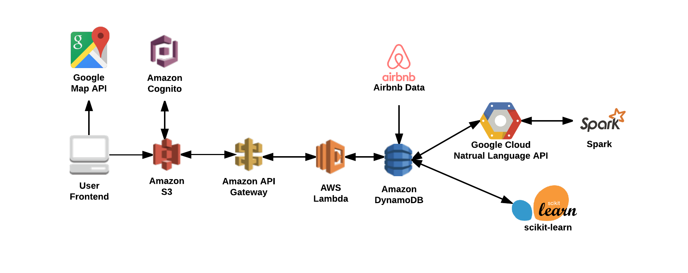

# Housify
Housify is a serverless web application that provides recommendations for users when booking accommodations on Airbnb. The application mainly implements three handy features: house listings, make rating and comments, and personalized recommendation. Cloud technologies utilized in this project include but not limited to DynamoDB, API Gateway, and Lambda Functions. Collaborative filtering and K Nearest Neighbor are the two underlying core algorithms for our recommendation engine.

